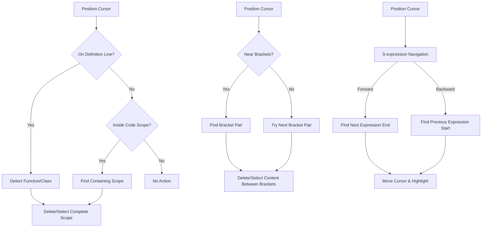

# 🛠️ VSCode Utilities

A Visual Studio Code extension that provides helpful utilities for code manipulation, editing, and navigation.

## ✨ Features

### 🗑️ Code Scope Management

This extension provides powerful commands to work with code scopes:

- **Delete Current Function/Method/Class/Interface/Enum**: Delete the entire code unit that your cursor is currently in or on
- **Delete Current Bracket Scope**: Delete the content between the nearest curly brackets (preserving the brackets themselves)
- **Select Current Scope**: Select and copy the entire function, method, class, interface, or enum
- **Select Current Bracket Scope**: Select and copy the content between the nearest curly brackets

These features help you quickly clean up, refactor, or reuse code without having to manually select large blocks of text.

### 🧭 S-expression Navigation (Emacs-like)

The extension provides Emacs-like S-expression navigation commands:

- **Forward S-expression**: Navigate to the end of the next balanced expression
- **Backward S-expression**: Navigate to the beginning of the previous balanced expression

These features help programmers quickly navigate through code by treating code as structured expressions (like Lisp S-expressions), jumping between balanced delimiters such as parentheses, brackets, and braces, as well as identifiers and literals.

### 📊 Status Bar Scope Indicator

The extension adds a status bar indicator that shows:

- The type and name of the current scope (function, class, interface, enum)
- Quick access to scope actions when clicked
- Visual indication of your current context in the code

## 🔄 How It Works

The extension intelligently:
- 🔍 Detects when your cursor is on or within a function/method/class/interface/enum
- 📍 Identifies the complete scope of the code block with proper boundary detection
- ✂️ Provides precise deletion or selection of just the content you want
- 🧠 Identifies balanced expressions for S-expression navigation
- 🚀 Navigates efficiently through code using structural patterns
- 📋 Automatically copies deleted or selected content to the clipboard (configurable)
- 🔆 Provides visual highlighting before deletion for confirmation (configurable)

### Command Comparison

| Command | Target | Preserves | Use Case |
|---------|--------|-----------|----------|
| `deleteCurrentScope` | Functions, Methods, Classes, etc. | Nothing | Complete removal of code units |
| `deleteCurrentBracketScope` | Content between `{ }` | Bracket pair | Clearing implementation while keeping structure |
| `selectCurrentScope` | Functions, Methods, Classes, etc. | Everything | Copy entire code units |
| `selectCurrentBracketScope` | Content between `{ }` | Everything | Copy implementation details |
| `forwardSexp` | Next balanced expression | Everything | Navigate to end of expression |
| `backwardSexp` | Previous balanced expression | Everything | Navigate to beginning of expression |

### 🧩 Supported Languages

These utilities work with:
- JavaScript
- TypeScript
- Python (for scope deletion/selection features)

Basic functionality should work in most languages that use curly braces or indentation-based code blocks.

## 📊 Extension Workflow



## 🚀 Usage

1. Position your cursor on or within a function, method, class, interface, or enum
2. Open the Command Palette (Ctrl+Shift+P or Cmd+Shift+P)
3. Run one of the following commands:
   - `Extension: Delete Current Scope`
   - `Extension: Delete Current Bracket Scope`
   - `Extension: Select Current Scope and Copy to Clipboard`
   - `Extension: Select Current Bracket Scope and Copy to Clipboard`
   - `Extension: Navigate to End of S-expression (Emacs-like Forward Sexp)`
   - `Extension: Navigate to Start of S-expression (Emacs-like Backward Sexp)`

4. Alternatively, use the status bar indicator to:
   - View your current scope context
   - Access scope actions via the quick menu
   - See scope type and name at a glance

## ⌨️ Keyboard Shortcuts

For faster access, the extension provides the following keyboard shortcuts:

```json
{
  "key": "ctrl+c ctrl+k",
  "command": "extension.deleteCurrentScope",
  "when": "editorTextFocus && !editorReadonly"
},
{
  "key": "ctrl+c ctrl+b",
  "command": "extension.deleteCurrentBracketScope",
  "when": "editorTextFocus && !editorReadonly"
},
{
  "key": "ctrl+c ctrl+a",
  "command": "extension.selectCurrentScope",
  "when": "editorTextFocus"
},
{
  "key": "ctrl+c ctrl+s",
  "command": "extension.selectCurrentBracketScope",
  "when": "editorTextFocus"
},
{
  "key": "ctrl+alt+f",
  "command": "extension.forwardSexp",
  "when": "editorTextFocus"
},
{
  "key": "ctrl+alt+b",
  "command": "extension.backwardSexp",
  "when": "editorTextFocus"
}
```

The S-expression navigation commands use the familiar Emacs keybindings:
- `Ctrl+Alt+F` - Forward S-expression
- `Ctrl+Alt+B` - Backward S-expression

## 📋 Requirements

- Visual Studio Code v1.54.0 or higher

## ⚙️ Extension Settings

This extension provides the following settings:

* `vscodeUtilities.highlightBeforeDeleting`: Toggle whether to highlight code before deletion and show a confirmation dialog (default: false)
* `vscodeUtilities.copyToClipboard`: Toggle whether to automatically copy deleted or selected content to the clipboard (default: true)

## ⚠️ Known Issues

- In some complex code structures, scope detection might not work perfectly
- Detection works best with well-formatted code
- S-expression navigation is optimized for TypeScript/JavaScript and may have limitations in other languages

## 📝 Release Notes

### 0.0.1

- Initial release with core functionality:
  - Delete functions, methods, classes, interfaces, and enums
  - Delete content within bracket scopes
  - Select and copy code scopes
  - Select and copy bracket scopes
  - Emacs-like S-expression navigation
  - Status bar scope indicator
  - Clipboard integration
  - Visual highlighting and confirmation dialogs
  - Support for TypeScript, JavaScript, and Python (scopes)

---

**Enjoy!**
