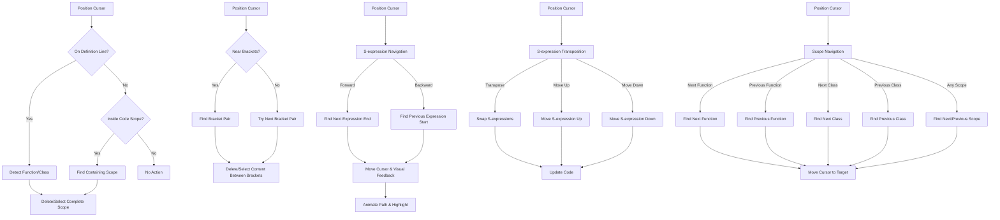

# 🛠️ VSCode Utilities

A Visual Studio Code extension that provides helpful utilities for code manipulation, editing, and navigation.

## ✨ Features

### 🗑️ Code Scope Management

This extension provides powerful commands to work with code scopes:

- **Delete Current Function/Method/Class/Interface/Enum**: Delete the entire code unit that your cursor is currently in or on
- **Delete Current Bracket Scope**: Delete the content between the nearest curly brackets (preserving the brackets themselves)
- **Select Current Scope**: Select and copy the entire function, method, class, interface, or enum
- **Select Current Bracket Scope**: Select and copy the content between the nearest curly brackets

These features help you quickly clean up, refactor, or reuse code without having to manually select large blocks of text.

### 🧭 S-expression Navigation and Selection (Emacs-like)

The extension provides Emacs-like S-expression navigation, selection, and transposition commands with enhanced visual feedback:

#### Navigation Commands
- **Forward S-expression**: Navigate to the end of the next balanced expression
- **Backward S-expression**: Navigate to the beginning of the previous balanced expression

#### Selection Commands
- **Mark S-expression**: Select the current or next balanced expression
- **Mark Parent S-expression**: Select the parent expression that contains the current cursor position
- **Expand Selection to Parent S-expression**: Expand the current selection to include the parent expression

#### Transposition Commands
- **Transpose S-expressions**: Swap the current S-expression with the next one
- **Move S-expression Up**: Move the current S-expression up in a list (swap with previous sibling)
- **Move S-expression Down**: Move the current S-expression down in a list (swap with next sibling)

These features help programmers quickly navigate, manipulate, and restructure code by treating code as structured expressions (like Lisp S-expressions), jumping between balanced delimiters such as parentheses, brackets, and braces, as well as identifiers and literals.

The enhanced visual feedback system provides:
- Visual highlighting of the source and target positions
- Animated path visualization showing the navigation direction
- Automatic detection and display of expression types (array, object, string, etc.)
- Temporary status bar and notification messages with navigation details
- Customizable animation duration and visual effects

### 🧩 Scope Navigation

The extension provides convenient commands to navigate between code structures in your document:

#### Function Navigation
- **Next Function**: Jump to the next function declaration in the document (`alt+down`)
- **Previous Function**: Jump to the previous function declaration in the document (`alt+up`)

#### Class Navigation
- **Next Class**: Jump to the next class declaration in the document (`alt+shift+down`)
- **Previous Class**: Jump to the previous class declaration in the document (`alt+shift+up`)

#### General Scope Navigation
- **Next Scope**: Jump to the next function or class declaration in the document (`alt+right`)
- **Previous Scope**: Jump to the previous function or class declaration in the document (`alt+left`)

These navigation features help you quickly move between important code structures without having to manually search or scroll through the document. When reaching the beginning or end of the document, navigation can optionally wrap around to the other end.

### 📊 Status Bar Scope Indicator

The extension adds a status bar indicator that shows:

- The type and name of the current scope (function, class, interface, enum)
- Quick access to scope actions when clicked
- Visual indication of your current context in the code

## 🔄 How It Works

The extension intelligently:
- 🔍 Detects when your cursor is on or within a function/method/class/interface/enum
- 📍 Identifies the complete scope of the code block with proper boundary detection
- ✂️ Provides precise deletion or selection of just the content you want
- 🧠 Identifies balanced expressions for S-expression navigation and selection
- 🚀 Navigates efficiently through code using structural patterns
- 📋 Automatically copies selected content to clipboard when configured
- 📋 Automatically copies deleted or selected content to the clipboard (configurable)
- 🔆 Provides visual highlighting before deletion for confirmation (configurable)
- 🎯 Renders enhanced visual feedback during S-expression navigation (configurable)

### Command Comparison

| Command | Target | Preserves | Use Case |
|---------|--------|-----------|----------|
| `deleteCurrentScope` | Functions, Methods, Classes, etc. | Nothing | Complete removal of code units |
| `deleteCurrentBracketScope` | Content between `{ }` | Bracket pair | Clearing implementation while keeping structure |
| `selectCurrentScope` | Functions, Methods, Classes, etc. | Everything | Copy entire code units |
| `selectCurrentBracketScope` | Content between `{ }` | Everything | Copy implementation details |
| `forwardSexp` | Next balanced expression | Everything | Navigate to end of expression |
| `backwardSexp` | Previous balanced expression | Everything | Navigate to beginning of expression |
| `markSexp` | Current or next balanced expression | Everything | Select expression |
| `markParentSexp` | Parent expression of current cursor position | Everything | Select parent expression |
| `expandSelectionToParentSexp` | Current selection | Everything | Expand selection to parent expression |
| `transposeSexp` | Current and next S-expression | Everything | Swap S-expressions |
| `moveSexpUp` | Current S-expression | Everything | Move S-expression up in a list |
| `moveSexpDown` | Current S-expression | Everything | Move S-expression down in a list |
| `nextFunction` | Next function declaration | Everything | Navigate to next function |
| `previousFunction` | Previous function declaration | Everything | Navigate to previous function |
| `nextClass` | Next class declaration | Everything | Navigate to next class |
| `previousClass` | Previous class declaration | Everything | Navigate to previous class |
| `nextScope` | Next function or class declaration | Everything | Navigate to next code structure |
| `previousScope` | Previous function or class declaration | Everything | Navigate to previous code structure |

### 🧩 Supported Languages

These utilities work with:
- JavaScript
- TypeScript
- Python (for scope deletion/selection features)

Basic functionality should work in most languages that use curly braces or indentation-based code blocks.

## 📊 Extension Workflow



## 🚀 Usage

1. Position your cursor on or within a function, method, class, interface, or enum
2. Open the Command Palette (Ctrl+Shift+P or Cmd+Shift+P)
3. Run one of the following commands:
   - `Extension: Delete Current Scope`
   - `Extension: Delete Current Bracket Scope`
   - `Extension: Select Current Scope and Copy to Clipboard`
   - `Extension: Select Current Bracket Scope and Copy to Clipboard`
   - `Extension: Navigate to End of S-expression (Emacs-like Forward Sexp)`
   - `Extension: Navigate to Start of S-expression (Emacs-like Backward Sexp)`
   - `Extension: Mark S-expression`
   - `Extension: Mark Parent S-expression`
   - `Extension: Expand Selection to Parent S-expression`
   - `Extension: Transpose S-expressions`
   - `Extension: Move S-expression Up`
   - `Extension: Move S-expression Down`
   - `Extension: Navigate to Next Function`
   - `Extension: Navigate to Previous Function`
   - `Extension: Navigate to Next Class`
   - `Extension: Navigate to Previous Class`
   - `Extension: Navigate to Next Scope (Function or Class)`
   - `Extension: Navigate to Previous Scope (Function or Class)`

4. Alternatively, use the status bar indicator to:
   - View your current scope context
   - Access scope actions via the quick menu
   - See scope type and name at a glance

## ⌨️ Keyboard Shortcuts

For faster access, the extension provides the following keyboard shortcuts:

```json
{
  "key": "ctrl+c ctrl+k",
  "command": "extension.deleteCurrentScope",
  "when": "editorTextFocus && !editorReadonly"
},
{
  "key": "ctrl+c ctrl+b",
  "command": "extension.deleteCurrentBracketScope",
  "when": "editorTextFocus && !editorReadonly"
},
{
  "key": "ctrl+c ctrl+a",
  "command": "extension.selectCurrentScope",
  "when": "editorTextFocus"
},
{
  "key": "ctrl+c ctrl+s",
  "command": "extension.selectCurrentBracketScope",
  "when": "editorTextFocus"
},
{
  "key": "ctrl+alt+f",
  "command": "extension.forwardSexp",
  "when": "editorTextFocus"
},
{
  "key": "ctrl+alt+b",
  "command": "extension.backwardSexp",
  "when": "editorTextFocus"
},
{
  "key": "ctrl+alt+m",
  "command": "extension.markSexp",
  "when": "editorTextFocus"
},
{
  "key": "ctrl+alt+p",
  "command": "extension.markParentSexp",
  "when": "editorTextFocus"
},
{
  "key": "ctrl+alt+e",
  "command": "extension.expandSelectionToParentSexp",
  "when": "editorTextFocus"
},
{
  "key": "ctrl+alt+t",
  "command": "extension.transposeSexp",
  "when": "editorTextFocus"
},
{
  "key": "ctrl+alt+up",
  "command": "extension.moveSexpUp",
  "when": "editorTextFocus"
},
{
  "key": "ctrl+alt+down",
  "command": "extension.moveSexpDown",
  "when": "editorTextFocus"
},
{
  "key": "alt+down",
  "command": "extension.nextFunction",
  "when": "editorTextFocus"
},
{
  "key": "alt+up",
  "command": "extension.previousFunction",
  "when": "editorTextFocus"
},
{
  "key": "alt+shift+down",
  "command": "extension.nextClass",
  "when": "editorTextFocus"
},
{
  "key": "alt+shift+up",
  "command": "extension.previousClass",
  "when": "editorTextFocus"
},
{
  "key": "alt+right",
  "command": "extension.nextScope",
  "when": "editorTextFocus"
},
{
  "key": "alt+left",
  "command": "extension.previousScope",
  "when": "editorTextFocus"
}
```

## 📋 Requirements

- Visual Studio Code v1.54.0 or higher

## ⚙️ Extension Settings

This extension provides the following settings:

* `vscodeUtilities.highlightBeforeDeleting`: Toggle whether to highlight code before deletion and show a confirmation dialog (default: false)
* `vscodeUtilities.copyToClipboard`: Toggle whether to automatically copy deleted or selected content to the clipboard (default: true)
* `vscodeUtilities.enhancedSexpNavigationAnimation`: Toggle enhanced animations during S-expression navigation (default: true)
* `vscodeUtilities.sexpNavigationHighlightDuration`: Duration in milliseconds for S-expression navigation highlights (default: 600)
* `vscodeUtilities.showExpressionTypeInStatusBar`: Toggle showing expression type in status bar during navigation (default: true)

## ⚠️ Known Issues

- In some complex code structures, scope detection might not work perfectly
- Detection works best with well-formatted code
- S-expression navigation is optimized for TypeScript/JavaScript and may have limitations in other languages

## 📝 Release Notes

### 0.0.1

- Initial release with core functionality:
  - Delete functions, methods, classes, interfaces, and enums
  - Delete content within bracket scopes
  - Select and copy code scopes
  - Select and copy bracket scopes
  - Emacs-like S-expression navigation with enhanced visual feedback
  - Status bar scope indicator
  - Clipboard integration
  - Visual highlighting and confirmation dialogs
  - Support for TypeScript, JavaScript, and Python (scopes)

---

**Enjoy!**
