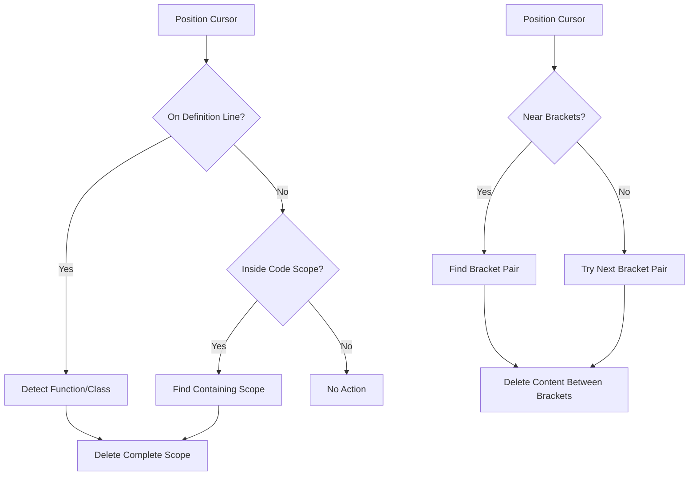

# 🛠️ VSCode Utilities

A Visual Studio Code extension that provides helpful utilities for code manipulation and editing.

## ✨ Features

### 🗑️ Delete Current Scope

This extension provides commands to quickly delete code scopes:

- **Delete Current Function/Method/Class**: Delete the entire function, method or class that your cursor is currently in or on
- **Delete Current Bracket Scope**: Delete the content between the nearest curly brackets (preserving the brackets themselves)

These features help you quickly clean up or refactor your code without having to manually select large blocks of text.

### 🧭 S-expression Navigation (Emacs-like)

The extension provides Emacs-like S-expression navigation commands:

- **Forward S-expression**: Navigate to the end of the next balanced expression
- **Backward S-expression**: Navigate to the beginning of the previous balanced expression

These features help programmers quickly navigate through code by treating code as structured expressions (like Lisp S-expressions), jumping between balanced delimiters such as parentheses, brackets, and braces, as well as identifiers and literals.

## 🔄 How It Works

The extension intelligently:
- 🔍 Detects when your cursor is on a function/method/class definition
- 📍 Detects when your cursor is inside a function/method/class body
- 🔎 Identifies the complete scope of the code block
- ✂️ Provides precise deletion of just the content you want to remove
- 🧠 Identifies balanced expressions for S-expression navigation
- 🚀 Navigates efficiently through code using structural patterns

### Command Comparison

| Command | Target | Preserves | Use Case |
|---------|--------|-----------|----------|
| `deleteCurrentScope` | Functions, Methods, Classes | Nothing | Complete removal of code units |
| `deleteCurrentBracketScope` | Content between `{ }` | Bracket pair | Clearing implementation while keeping structure |

### 🧩 Supported Languages

These utilities work best with:
- JavaScript
- TypeScript

However, basic functionality should work in most languages that use curly braces for code blocks.

## 📊 Extension Workflow



## 🚀 Usage

1. Position your cursor on or within a function, method or class
2. Open the Command Palette (Ctrl+Shift+P or Cmd+Shift+P)
3. Run one of the following commands:
   - `Extension: Delete Current Scope`
   - `Extension: Delete Current Bracket Scope`

## ⌨️ Keyboard Shortcuts

For faster access, you can set up keyboard shortcuts for these commands:

```json
{
  "key": "ctrl+alt+d",
  "command": "extension.deleteCurrentScope",
  "when": "editorTextFocus"
},
{
  "key": "ctrl+alt+b",
  "command": "extension.deleteCurrentBracketScope",
  "when": "editorTextFocus"
},
{
  "key": "ctrl+alt+f",
  "command": "extension.forwardSexp",
  "when": "editorTextFocus"
},
{
  "key": "ctrl+alt+p",
  "command": "extension.backwardSexp",
  "when": "editorTextFocus"
}
```

The S-expression navigation commands use the familiar Emacs keybindings:
- `Ctrl+Alt+F` - Forward S-expression
- `Ctrl+Alt+B` - Backward S-expression

## 📋 Requirements

- Visual Studio Code v1.54.0 or higher

## ⚙️ Extension Settings

This extension doesn't add any specific settings to VS Code.

## ⚠️ Known Issues

- In some complex code structures, scope detection might not work perfectly
- Detection works best with well-formatted code

## 📝 Release Notes

### 0.0.1

- Initial release
- Added commands for deleting functions, methods, and classes
- Added command for deleting content within bracket scopes

---

**Enjoy!**
