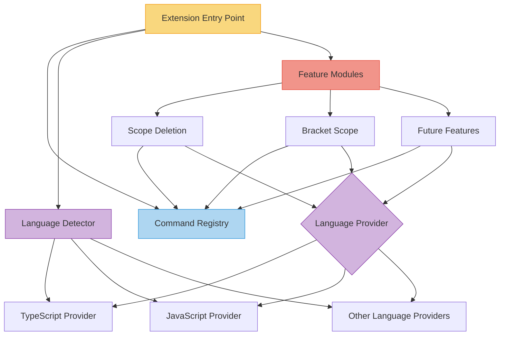
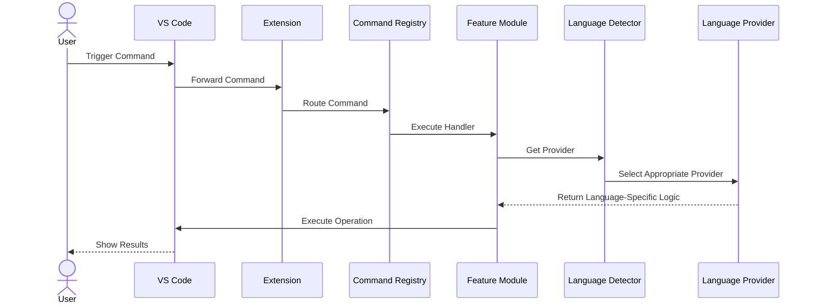

# 🏗️ VSCode Utilities Extension Architecture

## 🔍 Overview

This document outlines the architecture for the VSCode Utilities extension, designed to make the extension more extensible, maintainable, and capable of supporting multiple programming languages with different versions.

## 🧱 Core Architectural Principles

1. **📦 Modular Design**: Each feature is encapsulated in its own module
2. **🔄 Strategy Pattern**: Language-specific implementations are interchangeable
3. **💉 Dependency Injection**: Services and components are loosely coupled
4. **⚡ Progressive Enhancement**: Basic features work with all languages, advanced features with fully supported languages

## 🏛️ Architecture Components

### 1. Core Architectural Components

#### A. Command Registry 📝
- Central hub for registering all commands
- Each feature registers its commands through this registry
- Decouples command registration from implementation

#### B. Language Provider System 🌐
- Strategy pattern for language-specific implementations
- Language provider interface/abstract class
- Concrete implementations for each supported language
- Language detection service to select appropriate provider

#### C. Feature Modules 🧩
- Each feature (like scope deletion) becomes a self-contained module
- Modules register their commands with the command registry
- Modules request the appropriate language provider for operations

### 2. Directory Structure 📂

```
src/
├── extension.ts                 # Entry point - lean, just initializes core systems
├── core/
│   ├── command-registry.ts      # Central command registration system
│   ├── language-provider.ts     # Base interfaces for language providers
│   └── feature-module.ts        # Base class for feature modules
├── languages/
│   ├── language-detector.ts     # Detects active language
│   ├── javascript-provider.ts   # JavaScript implementation
│   ├── typescript-provider.ts   # TypeScript implementation 
│   └── other-language-providers/# Folder for future language providers
├── features/
│   ├── scope-deletion/          # Current scope deletion feature
│   │   ├── index.ts             # Feature entry point
│   │   ├── commands.ts          # Command definitions
│   │   └── operations.ts        # Core operations
│   ├── bracket-scope/           # Bracket scope feature
│   │   ├── index.ts
│   │   ├── commands.ts
│   │   └── operations.ts
│   └── [future-features]/       # Structure for new features
└── utils/
    ├── document-utils.ts        # Document helper functions
    └── position-utils.ts        # Position calculation utilities
```

### 3. Implementation Details 🔧

#### Language Provider Interface
```typescript
// core/language-provider.ts
export interface LanguageProvider {
  id: string;
  supportedVersions: string[];
  
  // Feature-specific methods
  findFunction(document: vscode.TextDocument, position: vscode.Position): CodeRange | null;
  findClass(document: vscode.TextDocument, position: vscode.Position): CodeRange | null;
  findBracketScope(document: vscode.TextDocument, position: vscode.Position): CodeRange | null;
  
  // Generic language capabilities
  supportsClassDeclarations: boolean;
  supportsArrowFunctions: boolean;
  // ... other capabilities
}
```

#### Feature Module Base Class
```typescript
// core/feature-module.ts
export abstract class FeatureModule {
  constructor(protected commandRegistry: CommandRegistry) {}
  
  abstract register(): void;
  abstract activate(): void;
  abstract deactivate(): void;
}
```

#### Command Registry
```typescript
// core/command-registry.ts
export class CommandRegistry {
  private commands: Map<string, vscode.Disposable> = new Map();
  
  register(id: string, command: (...args: any[]) => any): void {
    const disposable = vscode.commands.registerCommand(id, command);
    this.commands.set(id, disposable);
  }
  
  registerTextEditorCommand(id: string, command: (editor: vscode.TextEditor, edit: vscode.TextEditorEdit, ...args: any[]) => any): void {
    const disposable = vscode.commands.registerTextEditorCommand(id, command);
    this.commands.set(id, disposable);
  }
  
  getDisposables(): vscode.Disposable[] {
    return Array.from(this.commands.values());
  }
}
```

#### Scope Deletion Feature Example
```typescript
// features/scope-deletion/index.ts
export class ScopeDeletionFeature extends FeatureModule {
  register(): void {
    this.commandRegistry.registerTextEditorCommand(
      'extension.deleteCurrentScope', 
      this.handleDeleteScope.bind(this)
    );
  }
  
  private async handleDeleteScope(editor: vscode.TextEditor, edit: vscode.TextEditorEdit): Promise<void> {
    const languageDetector = container.get(LanguageDetector);
    const provider = languageDetector.getProviderForDocument(editor.document);
    
    if (!provider) {
      vscode.window.showInformationMessage(`Language not supported for scope deletion.`);
      return;
    }
    
    const position = editor.selection.active;
    
    // Check for function scope
    const functionRange = provider.findFunction(editor.document, position);
    if (functionRange) {
      await this.deleteRange(editor, functionRange);
      return;
    }
    
    // Check for class scope
    const classRange = provider.findClass(editor.document, position);
    if (classRange) {
      await this.deleteRange(editor, classRange);
      return;
    }
    
    vscode.window.showInformationMessage("Cursor is not within a supported code scope.");
  }
  
  // Other implementation methods...
}
```

### 4. Dependency Injection 💉

```typescript
// core/container.ts
export class ServiceContainer {
  private services: Map<string, any> = new Map();
  
  register<T>(id: string, instance: T): void {
    this.services.set(id, instance);
  }
  
  get<T>(id: string): T {
    return this.services.get(id) as T;
  }
}

export const container = new ServiceContainer();
```

### 5. Extension Entry Point 🚪

```typescript
// extension.ts
export function activate(context: vscode.ExtensionContext) {
  // Set up core services
  const commandRegistry = new CommandRegistry();
  container.register('commandRegistry', commandRegistry);
  
  const languageDetector = new LanguageDetector();
  container.register('languageDetector', languageDetector);
  
  // Register language providers
  languageDetector.registerProvider(new TypeScriptProvider());
  languageDetector.registerProvider(new JavaScriptProvider());
  // Add more language providers here
  
  // Activate features
  const features: FeatureModule[] = [
    new ScopeDeletionFeature(commandRegistry),
    new BracketScopeFeature(commandRegistry),
    // Add more features here
  ];
  
  // Register and activate all features
  features.forEach(feature => {
    feature.register();
    feature.activate();
  });
  
  // Add all disposables to context
  context.subscriptions.push(...commandRegistry.getDisposables());
}
```

## ✅ Benefits of This Architecture

| Benefit | Description |
|---------|-------------|
| **🔌 Extensibility** | • Adding new features is as simple as creating a new feature module<br>• Adding language support only requires implementing a new language provider |
| **🧹 Maintainability** | • Clear separation of concerns<br>• Isolated modules with focused responsibilities<br>• Easier to test individual components |
| **🔢 Language Versioning** | • Each language provider can support multiple versions<br>• Version-specific logic is encapsulated in the provider |
| **♻️ Code Reuse** | • Common utilities extracted to shared modules<br>• Less duplication across features |
| **🚀 Progressive Enhancement** | • Basic features can work across many languages<br>• Advanced features can be available only for fully supported languages |

## 🔄 System Architecture Flow



## 📌 Feature Command Flow



## 📋 Implementation Roadmap

| Phase | Task | Priority | Complexity |
|-------|------|----------|------------|
| **1** | Refactor existing code | High | Medium |
|       | • Separate language-specific logic from operations | | |
|       | • Create TypeScript and JavaScript providers | | |
|       | • Move utility functions to appropriate modules | | |
| **2** | Create core infrastructure | High | High |
|       | • Implement command registry | | |
|       | • Build language provider system | | |
|       | • Set up feature module base classes | | |
| **3** | Add configuration system | Medium | Medium |
|       | • Allow per-language settings | | |
|       | • Support feature-specific configurations | | |
| **4** | Test with new languages | Medium | High |
|       | • Implement a provider for a third language | | |
|       | • Verify extension with multiple languages | | |

## 🎨 Design Patterns Used

| Pattern | Component | Purpose |
|---------|-----------|---------|
| **🔄 Strategy** | Language Provider | Interchangeable language-specific implementations |
| **💉 Dependency Injection** | Service Container | Loose coupling between components |
| **📝 Command** | Command Registry | Encapsulate all information needed to perform an action |
| **📦 Module** | Feature Modules | Organize related functionality |
| **🏭 Factory** | Language Provider Creation | Create appropriate language providers |
