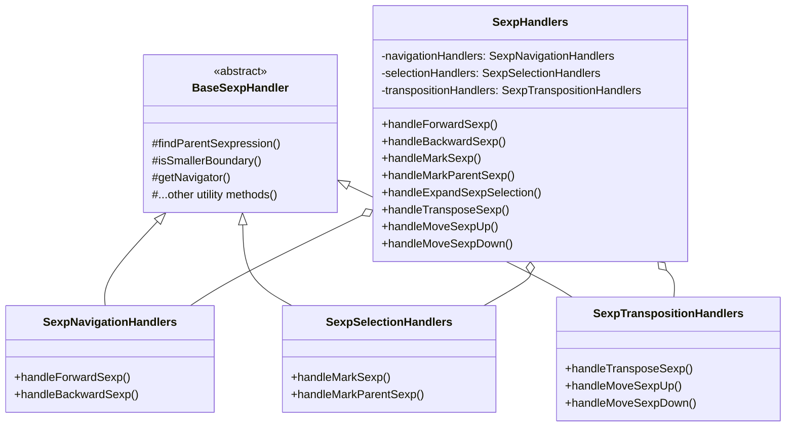
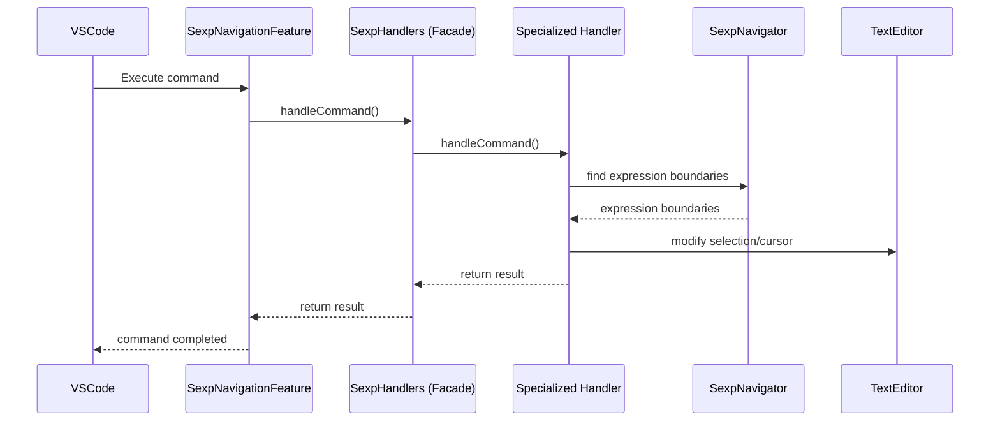
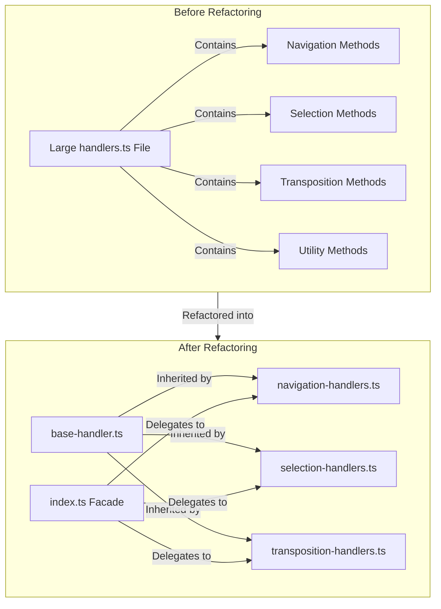

# 🏗️ VSCode Utilities Extension Architecture

## 🔍 Overview

This document outlines the architecture for the VSCode Utilities extension, designed to make the extension more extensible, maintainable, and capable of supporting multiple programming languages with different versions.

## 🧱 Core Architectural Principles

1. **📦 Modular Design**: Each feature is encapsulated in its own module
2. **🔄 Strategy Pattern**: Language-specific implementations are interchangeable
3. **💉 Dependency Injection**: Services and components are loosely coupled
4. **⚡ Progressive Enhancement**: Basic features work with all languages, advanced features with fully supported languages
5. **🔍 Separation of Concerns**: UI, business logic, and language-specific operations are separated

## 🏛️ Architecture Components

### 1. Core Architectural Components

#### A. Command Registry 📝
- Central hub for registering all commands
- Each feature registers its commands through this registry
- Decouples command registration from implementation

#### B. Language Provider System 🌐
- Strategy pattern for language-specific implementations
- Language provider interface/abstract class
- Concrete implementations for each supported language
- Language detection service to select appropriate provider

#### C. Feature Modules 🧩
- Each feature (like scope deletion) becomes a self-contained module
- Modules register their commands with the command registry
- Modules request the appropriate language provider for operations
- Features follow a consistent internal structure:
  - `types.ts`: Common interfaces and types
  - `finders/`: Language-specific implementations for finding code structures
  - `handlers.ts`: Command handlers and business logic
  - `ui-utils.ts`: UI-related utilities and presentation logic
  - `index.ts`: Feature entry point and re-exports

### 2. Directory Structure 📂

```
src/
├── extension.ts                 # Entry point - lean, just initializes core systems
├── core/
│   ├── command-registry.ts      # Central command registration system
│   ├── language-provider.ts     # Base interfaces for language providers
│   └── feature-module.ts        # Base class for feature modules
├── languages/
│   ├── language-detector.ts     # Detects active language
│   ├── javascript-provider.ts   # JavaScript implementation
│   ├── typescript-provider.ts   # TypeScript implementation 
│   └── other-language-providers/# Folder for future language providers
├── features/
│   ├── scope-deletion/          # Scope deletion feature (refactored)
│   │   ├── index.ts             # Feature entry point
│   │   ├── types.ts             # Common interfaces and types
│   │   ├── ui-utils.ts          # UI-related utilities
│   │   ├── handlers.ts          # Command handlers
│   │   └── finders/             # Language-specific finders
│   │       ├── index.ts         # Factory for language finders
│   │       ├── typescript-finder.ts # TypeScript implementation
│   │       └── python-finder.ts # Python implementation
│   ├── bracket-scope/           # Bracket scope feature (refactored)
│   │   ├── index.ts             # Feature entry point
│   │   ├── types.ts             # Common interfaces and types
│   │   ├── ui-utils.ts          # UI-related utilities
│   │   ├── handlers.ts          # Command handlers
│   │   └── finders/             # Language-specific finders
│   │       ├── index.ts         # Factory for language finders
│   │       └── curly-bracket-finder.ts # Curly bracket implementation
│   └── [future-features]/       # Structure for new features
└── utils/
    ├── document-utils.ts        # Document helper functions
    └── position-utils.ts        # Position calculation utilities
```

### 3. Implementation Details 🔧

#### Feature Module Internal Structure

The scope-deletion and bracket-scope features now follow a consistent internal structure:

1. **Types**: Define common interfaces and types needed across the feature
   ```typescript
   // features/scope-deletion/types.ts
   export interface ScopeInfo {
     scopeType: ScopeType;
     name: string;
     startLine: number;
   }
   
   export interface ScopeFinder {
     readonly languageId: string;
     findContainingFunction(document: vscode.TextDocument, position: vscode.Position): ScopeInfo | null;
     findContainingClass(document: vscode.TextDocument, position: vscode.Position): ScopeInfo | null;
     findScopeBoundary(document: vscode.TextDocument, startLine: number, currentLine: number): number | null;
   }
   ```

2. **Finders**: Language-specific implementations for finding code structures
   ```typescript
   // features/scope-deletion/finders/typescript-finder.ts
   export class TypeScriptScopeFinder implements ScopeFinder {
     public readonly languageId: string = 'typescript';
     
     public findContainingFunction(document: vscode.TextDocument, position: vscode.Position): ScopeInfo | null {
       // TypeScript-specific implementation
     }
     
     public findContainingClass(document: vscode.TextDocument, position: vscode.Position): ScopeInfo | null {
       // TypeScript-specific implementation
     }
   }
   
   // features/scope-deletion/finders/python-finder.ts
   export class PythonScopeFinder implements ScopeFinder {
     public readonly languageId: string = 'python';
     
     public findContainingFunction(document: vscode.TextDocument, position: vscode.Position): ScopeInfo | null {
       // Python-specific implementation using indentation-based scoping
     }
     
     public findContainingClass(document: vscode.TextDocument, position: vscode.Position): ScopeInfo | null {
       // Python-specific implementation using indentation-based scoping
     }
   }
   
   // features/scope-deletion/finders/index.ts
   export class ScopeFinderFactory {
     private static finders: Map<string, ScopeFinder> = new Map();
     
     public static getFinder(languageId: string): ScopeFinder {
       // Return appropriate finder for language
     }
     
     public static registerFinder(finder: ScopeFinder): void {
       // Register a new finder
     }
   }
   ```

3. **Handlers**: Command handlers and business logic
   ```typescript
   // features/scope-deletion/handlers.ts
   export class ScopeHandlers {
     public static async handleDeleteScope(editor: vscode.TextEditor, edit: vscode.TextEditorEdit, currentScopeInfo: ScopeInfo | null): Promise<void> {
       // Implementation that uses the appropriate finder and UI utils
     }
     
     public static async handleSelectScope(editor: vscode.TextEditor, edit: vscode.TextEditorEdit, currentScopeInfo: ScopeInfo | null): Promise<void> {
       // Implementation that uses the appropriate finder and UI utils
     }
   }
   ```

4. **UI Utilities**: UI-related utilities and presentation logic
   ```typescript
   // features/scope-deletion/ui-utils.ts
   export class ScopeUiUtils {
     public static showSuccessMessage(scopeType: ScopeType, scopeName: string, linesRemoved: number): void {
       // Show appropriate message
     }
     
     public static async highlightAndConfirmDeletion(editor: vscode.TextEditor, startLine: number, scopeType: string): Promise<boolean> {
       // Highlight scope and ask for confirmation
     }
   }
   ```

5. **Feature Entry Point**: Coordinates between components and re-exports
   ```typescript
   // features/scope-deletion/index.ts
   export class ScopeDeletionFeature extends FeatureModule {
     constructor(commandRegistry: CommandRegistry) {
       super(commandRegistry, 'Scope Deletion');
       // Initialize
       ScopeFinderFactory.initialize();
     }
     
     register(): void {
       // Register commands using the handlers
     }
     
     // Other methods...
   }
   
   // Re-export types and utilities for external use
   export * from './types';
   export * from './finders';
   export * from './handlers';
   export * from './ui-utils';
   ```

#### Language Provider Interface
```typescript
// core/language-provider.ts
export interface LanguageProvider {
  id: string;
  supportedVersions: string[];
  
  // Feature-specific methods
  findFunction(document: vscode.TextDocument, position: vscode.Position): CodeRange | null;
  findClass(document: vscode.TextDocument, position: vscode.Position): CodeRange | null;
  findBracketScope(document: vscode.TextDocument, position: vscode.Position): CodeRange | null;
  
  // Generic language capabilities
  supportsClassDeclarations: boolean;
  supportsArrowFunctions: boolean;
  // ... other capabilities
}
```

#### Feature Module Base Class
```typescript
// core/feature-module.ts
export abstract class FeatureModule {
  constructor(protected commandRegistry: CommandRegistry) {}
  
  abstract register(): void;
  abstract activate(): void;
  abstract deactivate(): void;
}
```

#### Command Registry
```typescript
// core/command-registry.ts
export class CommandRegistry {
  private commands: Map<string, vscode.Disposable> = new Map();
  
  register(id: string, command: (...args: any[]) => any): void {
    const disposable = vscode.commands.registerCommand(id, command);
    this.commands.set(id, disposable);
  }
  
  registerTextEditorCommand(id: string, command: (editor: vscode.TextEditor, edit: vscode.TextEditorEdit, ...args: any[]) => any): void {
    const disposable = vscode.commands.registerTextEditorCommand(id, command);
    this.commands.set(id, disposable);
  }
  
  getDisposables(): vscode.Disposable[] {
    return Array.from(this.commands.values());
  }
}
```

### 4. Refactoring Patterns 🔄

#### A. Handler Specialization Pattern 🧩

As features grow in complexity, handler files can become large and difficult to maintain. The Handler Specialization Pattern splits large handler files into smaller, specialized modules based on functionality:

1. **Base Handler**: Create a base abstract class with common utility methods
2. **Specialized Handlers**: Create specialized handler classes for different operation types
3. **Facade Handler**: Use a facade pattern to maintain backward compatibility

```
handlers/
├── base-handler.ts         # Abstract base class with shared utility methods
├── navigation-handlers.ts  # Specific operation type handlers
├── selection-handlers.ts   # Specific operation type handlers
├── transposition-handlers.ts # Specific operation type handlers
└── index.ts                # Facade that maintains API compatibility
```

##### Visual Representation

###### Class Relationship Diagram



###### Command Flow Diagram



###### Refactoring Transformation



##### Example Implementation:

```typescript
// Base abstract class with shared methods
// handlers/base-handler.ts
export abstract class BaseSexpHandler {
  // Common utility methods used across handlers
  protected findParentSexpression(...) { /* implementation */ }
  protected isSmallerBoundary(...) { /* implementation */ }
  // Other utility methods...
}

// Specialized handlers for specific operations
// handlers/navigation-handlers.ts
export class SexpNavigationHandlers extends BaseSexpHandler {
  public async handleForwardSexp(...) { /* implementation */ }
  public async handleBackwardSexp(...) { /* implementation */ }
}

// handlers/selection-handlers.ts
export class SexpSelectionHandlers extends BaseSexpHandler {
  public async handleMarkSexp(...) { /* implementation */ }
  public async handleMarkParentSexp(...) { /* implementation */ }
  // Other selection methods...
}

// handlers/index.ts - Facade pattern
export class SexpHandlers {
  private navigationHandlers = new SexpNavigationHandlers();
  private selectionHandlers = new SexpSelectionHandlers();
  
  // Public API maintains the same interface
  public async handleForwardSexp(...) {
    return this.navigationHandlers.handleForwardSexp(...);
  }
  
  public async handleMarkSexp(...) {
    return this.selectionHandlers.handleMarkSexp(...);
  }
  // Other methods...
}

// For backward compatibility
export { SexpHandlers as SexpNavigationHandlers };
```

##### Benefits:

1. **🔍 Improved Focus**: Each handler class has a single responsibility
2. **🧰 Better Maintainability**: Smaller files are easier to understand and modify
3. **👥 Team Collaboration**: Different developers can work on different handler types
4. **🧪 Testability**: Specialized handlers are easier to test in isolation
5. **♻️ Code Reuse**: Base handler provides common functionality to all specialized handlers
6. **🔄 Backward Compatibility**: Facade pattern preserves the public API

##### When to Apply:

* When a single handler file exceeds 300-500 lines
* When a handler implements multiple distinct operation types
* When there's significant duplication between different handler methods
* When different parts of the handler file change at different rates

##### Real-World Example:

The S-expression navigation feature was refactored using this pattern, splitting the original 600+ line handler file into specialized modules for navigation, selection, and transposition operations while maintaining the same public API.

#### B. Feature Module Pattern 🧰

{{ ... }}

### 5. Dependency Injection 💉

```typescript
// core/container.ts
export class ServiceContainer {
  private services: Map<string, any> = new Map();
  
  register<T>(id: string, instance: T): void {
    this.services.set(id, instance);
  }
  
  get<T>(id: string): T {
    return this.services.get(id) as T;
  }
}

export const container = new ServiceContainer();
```

### 6. Extension Entry Point 🚪

```typescript
// extension.ts
export function activate(context: vscode.ExtensionContext) {
  // Set up core services
  const commandRegistry = new CommandRegistry();
  container.register('commandRegistry', commandRegistry);
  
  const languageDetector = new LanguageDetector();
  container.register('languageDetector', languageDetector);
  
  // Register language providers
  languageDetector.registerProvider(new TypeScriptProvider());
  languageDetector.registerProvider(new JavaScriptProvider());
  languageDetector.registerProvider(new PythonProvider());
  // Add more language providers here
  
  // Activate features
  const features: FeatureModule[] = [
    new ScopeDeletionFeature(commandRegistry),
    new BracketScopeFeature(commandRegistry),
    // Add more features here
  ];
  
  features.forEach(feature => {
    feature.register();
    feature.activate();
    context.subscriptions.push({
      dispose: () => feature.deactivate()
    });
  });
  
  // Register all commands with context
  context.subscriptions.push(...commandRegistry.getDisposables());
}
```

## 📈 Roadmap & Implementation Strategy

### Phase 1: Refactoring for Modularity

- ✅ Extract feature modules into their own directories
- ✅ Implement base classes and interfaces for features
- ✅ Refactor bracket-scope feature to new architecture
- ✅ Refactor scope-deletion feature to new architecture

### Phase 2: Language Provider System

- 🔄 Define language provider interface
- 🔄 Implement TypeScript/JavaScript providers
- 🔄 Create language detection service
- 🔄 Update features to use language providers

### Phase 3: Additional Language Support

- ✅ Implement Python provider
- 🕒 Implement Java provider
- 🕒 Implement C# provider
- 🕒 Add tests for language-specific features

### Phase 4: Advanced Features & Optimization

- 🕒 Add scope visualization feature
- 🕒 Implement scope insertion commands
- 🕒 Performance optimization for large files
- 🕒 User-configurable language settings

## 📊 Implementation Priority

| Priority | Task | Importance | Difficulty |
|----------|------|------------|------------|
| **1** | Refactor existing code | High | Medium |
|       | • Separate language-specific logic from operations | | |
|       | • Create TypeScript and JavaScript providers | | |
|       | • Move utility functions to appropriate modules | | |
| **2** | Create core infrastructure | High | High |
|       | • Implement command registry | | |
|       | • Create feature module base class | | |
|       | • Design language provider interface | | |
| **3** | Add support for more languages | Medium | Medium |
|       | • ✅ Python | | |
|       | • Java | | |
|       | • C# | | |
| **4** | Implement advanced features | Low | High |
|       | • Scope visualization | | |
|       | • Custom scope rules | | |
|       | • Performance optimizations | | |
